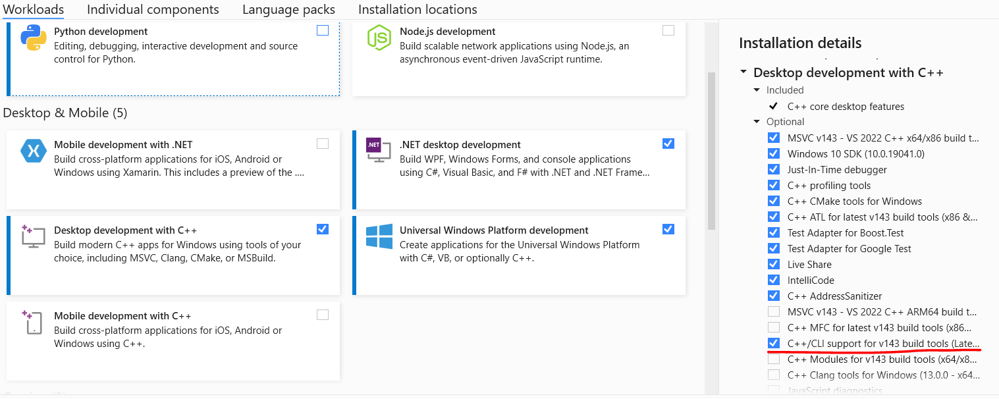

# IJWReprod
This repository contains an upcall and downcall profiling procedure using [IJW scheme](https://docs.microsoft.com/en-us/cpp/dotnet/calling-native-functions-from-managed-code?view=msvc-170) provided by Microsoft

## Requirements
* Visual Studio 2022
  * Make sure CLR is installed - ensure that `C++/CLI` support is checked in the installer

## Setup
1. Create a new project using CLR Console App in Visual Studio.
2. Import the [file](./IJWReprod/IJWReprod/IJWReprod.cpp) in the main source code.
3. Run using `Start without debugging` (CTRL+F5 for Windows)

Alternatively, you can try to download the entire `IJWReprod` solution.

## Results
* Simple data types - cross-compatible passed around.
  * Type conversion found [here](https://docs.microsoft.com/en-us/cpp/dotnet/managed-types-cpp-cli?view=msvc-170)
* Complex data types (`struct`, `vector`, `list`, etc.) has to be manually copied.

## Further Study
* Use library-based approach (`.lib` or DLL)
* Profile chain of upcall & downcall
* Varying type T of vectors, arrays. Also, more member fields in structs
* Serialization approach for passing structs
